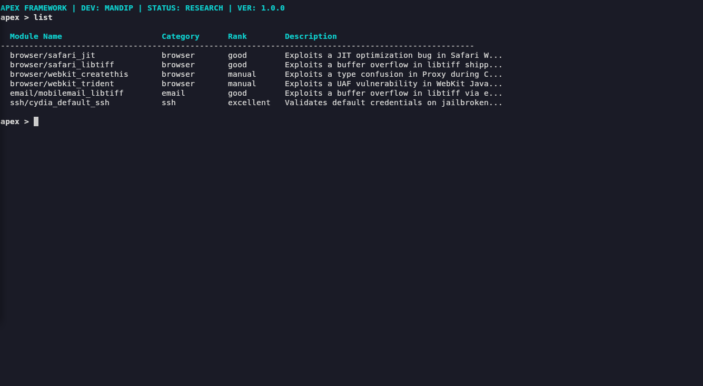

# ApexFramework

A high-performance Ruby-based framework for security research, protocol validation, and automated network infrastructure analysis.

---

## Legal Disclaimer

**DISCLAIMER: This framework is intended strictly for professional security research, educational purposes, and authorized infrastructure testing. The user assumes all responsibility for compliance with local and international laws. The author is not responsible for any misuse, unauthorized access, or illegal activities resulting from the use of this tool. Use of this software for malicious purposes is strictly prohibited.**

---

## Overview

ApexFramework provides a modular, lightweight console interface designed to load and execute research modules targeting SSH, HTTP, and SMTP transport layers. The suite features type-safe configuration validation, robust error handling, and isolated runtime execution to prevent service leakage and signal collisions during active testing.



---

## Features

* **Modular Scan Engine**: Dynamic runtime discovery and registry verification of Ruby-based exploit modules.
* **Hardened Transport Layers**: Isolated protocol validation structures utilizing robust connection management:
  * **SSH**: Non-interactive brute-force checks with strict timeout validation.
  * **HTTP**: Suppressed WEBrick server instances utilizing local binding with clean interruption boundaries.
  * **SMTP**: Encoded MIME attachment generation and RFC-compliant mail validation.
* **Zero-Leak Lifecycle**: Independent signal trap redirection to prevent console session hangs.
* **Strict Parameter Coercion**: Runtime option validation ensuring type-safe inputs (port ranges, file existence, and booleans).

---

## Workflow Logic

```text
[framework.rb Init]
         │
         ▼
[ModuleScanner Loads modules/]
         │
         ▼
[Readline Console Loop] ◄──────────────────────────────┐
         │                                             │
         ▼                                             │
[Select Module]                                        │
         │                                             │
         ▼                                             │
[Configure Options via OptionStore]                    │
         │                                             │
         ▼                                             │
[Execute Module (run)]                                 │
         │                                             │
         ▼                                             │
[Initialize Transport Layer]                           │
         │                                             │
         ▼                                             │
[Run Verification Code]                                │
         │                                             │
         ▼                                             │
[Isolated Release & Teardown] ─────────────────────────┘
```

---

## Requirements

### Operating System
* Linux / macOS (WEBrick utilizes local log sinks pointing to `/dev/null`).

### Environment Dependencies
* Ruby (version 2.5 or higher recommended).
* Rubygems:
  * `net-ssh` (for SSH modules)
  * `webrick` (required for Ruby 3.x+ environments)

```bash
gem install net-ssh webrick
```

---

## Project Structure

```text
APEX_FRAMEWORK/
├── framework.rb              # Core interactive console
├── lib/
│   ├── apex_module.rb         # Base class & registry logic
│   ├── logger.rb              # Colorized terminal logging mixin
│   └── option_store.rb        # Strict validation & option store
└── modules/
    ├── ssh/                  # SSH credential & logic checks
    ├── browser/              # Webkit/Safari protocol validation modules
    └── email/                # MIME SMTP delivery validation modules
```

---

## Usage

Start the interactive console from the repository root:

```bash
ruby framework.rb
```

### Commands

| Command | Action |
|---------|--------|
| `list` | View loaded research modules. |
| `select <module_name>` | Load a specific module into active focus (e.g. `select browser/safari_jit`). |
| `info` | Display active module metadata, Rank, CVE, and target disclosure details. |
| `options` | View option requirements, current values, and descriptions. |
| `set <option> <value>` | Set active option parameters (e.g. `set SRVPORT 9090`). |
| `run` | Execute the active module run logic. |
| `back` | Deselect the active module. |
| `clear` | Clear the terminal screen buffer. |
| `exit` | Shutdown transport services and exit the console. |

### CLI Example

```text
apex > list
  Module Name                     Category      Rank        Description
  ----------------------------------------------------------------------------------------------------
  browser/safari_jit              browser       good        Safari Webkit JIT Exploit for iOS 7.1.2...
  browser/safari_libtiff          browser       good        Exploits a buffer overflow in libtiff s...
  browser/webkit_createthis       browser       manual      Exploits a type confusion in Proxy duri...
  browser/webkit_trident          browser       manual      Exploits a UAF vulnerability in WebKit ...
  email/mobilemail_libtiff        email         good        Exploits a buffer overflow in libtiff v...
  ssh/cydia_default_ssh           ssh           excellent   Validates default credentials on jailbr...

apex > select browser/safari_jit
[+] Selected: browser/safari_jit

apex(browser/safari_jit) > options

Options:
  Name            Type     Required Value        Description
  ---------------------------------------------------------------------------
  SRVHOST         string   yes      127.0.0.1    HTTP listen address
  SRVPORT         port     yes      8080         HTTP listen port
  LHOST           string   yes      <nil>        Callback host
  LPORT           port     yes      4444         Callback port
  ...

apex(browser/safari_jit) > set LHOST 10.0.0.5
[+] LHOST => 10.0.0.5

apex(browser/safari_jit) > run
[*] Executing: Safari Webkit JIT Exploit for iOS 7.1.2
------------------------------------------------------------
[*] Starting HTTP server on 127.0.0.1:8080
[+] Server running. Waiting for target...
```

---

## Target Systems

The framework is optimized for iOS and Unix-based environments, specifically targeting memory-management vulnerabilities in historical and modern OS architectures.

